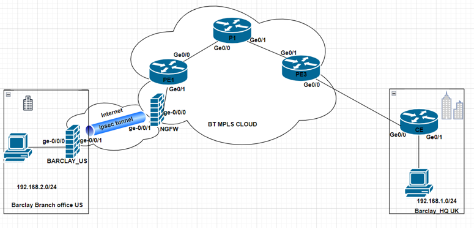

# Secure IPSec-over-MPLS Enterprise Branch Connectivity

This project is based on my MSc research in Computer Networks and Security at the University of Staffordshire. It demonstrates a secure and resilient enterprise network architecture that connects a remote branch office to a headquarters site using **MPLS Layer 3 VPN**, overlaid with **IPSec encryption** to protect data across an ISP core network.

The lab is built using a multi-vendor topology featuring **Cisco routers** and **Juniper SRX firewalls**. It showcases a real-world use case for secure WAN deployment, including network segmentation, route redistribution, and site-to-site VPN.

---

## 🧠 Objectives

- Deploy an IPSec tunnel across an MPLS Layer 3 VPN architecture
- Simulate a real-world ISP CE/PE design with Cisco routers and Juniper SRX firewalls
- Implement dynamic routing using OSPF and MP-BGP
- Demonstrate how VRFs and GRE tunnels can be used for path isolation
- Validate connectivity scenarios with test outputs

---

## 🛠️ Technologies & Tools Used

| Category        | Details                                  |
|-----------------|------------------------------------------|
| Routing         | OSPF, MP-BGP, VRF                        |
| VPN             | IPSec (Tunnel Mode, IKEv2)               |
| Vendors         | Cisco IOS, Juniper SRX                   |
| Virtualisation  | VMware Workstation, EVE-NG               |
| Lab Simulation  | EVE-NG Emulator                          |
| Security        | ACLs, Firewall Policies, IPSec Tunnels   |
| Tools           | ping, traceroute, CLI-based testing      |

---

## 🔧 Topology Overview

The lab simulates an enterprise head office and a remote branch, connected via an ISP MPLS network. IPSec tunnels provide secure encrypted communication between the two sites.

📍 _Topology Diagram:_

---

## 📁 Project Structure

secure-enterprise-mpls-ipsec/
│
├── README.md # This file
├── LAB_TOPOLOGY.png # Topology diagram (PNG format)
├── CONFIGS/ # Device configuration files
│ ├── cisco_PE1_config.txt
│ ├── cisco_CE1_config.txt
│ ├── cisco_PE2_config.txt
│ ├── juniper_SRX1_config.txt
│ └── juniper_SRX2_config.txt
│
├── LAB_GUIDE/ # Step-by-step implementation guide
│ └── step-by-step.md
│
├── TEST_RESULTS/ # Ping, traceroute, and failover test logs
│ └── ping-traceroute-validation.md
│
├── scripts/ # Optional automation or backup scripts
│ └── backup_config_script.sh
│
└── LICENSE # Open source license

---

### 📄 Lab Reproduction Guide

Follow the detailed steps in the [LAB_GUIDE/step-by-step.md](./LAB_GUIDE/step-by-step.md) to recreate the full lab environment using EVE-NG and virtual router images.

### ⚙️ Setup Requirements:

- [EVE-NG Community or Pro](https://www.eve-ng.net/)
- Cisco IOS images (ISR/CSR)
- Juniper SRX images (vSRX)
- VMware Workstation / ESXi host (optional)
- Basic familiarity with Cisco CLI and JunOS

---

## 📊 Test Outputs

Validation was done using:
- **Ping and Traceroute** to verify end-to-end reachability
- **Tunnel status checks** on Juniper and Cisco
- **Route redistribution** and VRF verification
- **Failover scenarios** by shutting interfaces and observing recovery

📄 See [`TEST_RESULTS/ping-traceroute-validation.md`](./TEST_RESULTS/ping-traceroute-validation.md)

---

## 🧠 Learning Outcomes

This project demonstrates how to:
- Build a hybrid VPN/MPLS network
- Apply VRFs and GRE for secure traffic segmentation
- Deploy IKEv2 IPSec tunnels between firewalls
- Validate secure communications in a simulated ISP environment
- Troubleshoot connectivity, tunnel negotiation, and BGP advertisements

---

## 💡 Use Cases

- Enterprise branch office connectivity
- Hybrid MPLS + Internet backup designs
- Service Provider Lab Simulation
- Training material for network security and design

---

## 🙋 About the Author

**Festus Orioke**  
MSc Computer Networks & Security  
📍 Stoke-on-Trent, UK  
📧 [festusorioke@gmail.com](mailto:festusorioke@gmail.com)  
🔗 [LinkedIn: linkedin.com/in/mountfestus](https://linkedin.com/in/mountfestus)

---

## 🏷️ Tags

`Cisco` `Juniper` `MPLS` `IPSec` `BGP` `OSPF` `VRF` `GRE` `EVE-NG` `vSRX` `Network Security` `Infrastructure-as-Code` `TechNation`

---

## 📢 Contributing

Feel free to fork, use, or enhance this project. Contributions are welcome, especially improvements to automation scripts, configurations, or documentation clarity.

---

## 📜 License

This project is licensed under the [MIT License](./LICENSE). You are free to use, modify, and distribute with attribution.

